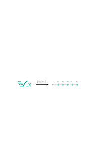

# vlx-dmrg

**vlx-dmrg** is a DMRG solver in the MPO formalism that uses VeloxChem (VLX) as the backend for SCF/MOs and integral construction to assemble the Hamiltonian. The initial release aims to serve as a minimal, didactic example.

<br>
<br>
<p align="center">
  
</p>
<br>


## Installation

**Dependencies**

The dependencies of **vlx-dmrg** are the same as that for [VeloxChem][VeloxChem], but are nonetheless given below:
* [CMake]
* [NumPy]
* [Eigen]
* [Python] ($`\geq`$ 3.10)
* C++ compiler supporting the C++20 standard and OpenMP
* [scikit-build]
* [Libxc]

**Installation**

We highly recommend that you install vlx-dmrg in a conda environment.
If you don't already have conda, install [Miniconda](https://www.anaconda.com/download/success) 
following the [instructions](https://www.anaconda.com/docs/getting-started/miniconda/install) for your operating system. 
Once you have miniconda, create a new conda environment using the [myenv.yml](https://drive.google.com/file/d/1e44vjI2q-3aW41ChRvum1KCcGCevo2tf/view?usp=sharing) file.
In a terminal (or Anaconda Powershell prompt for Windows), run:

```
conda env create -f vlxdmrg_env.yml
```

Activate the conda environment:

```
conda activate vlxdmrgenv
```

Clone the repository with:

```
git clone https://github.com/e-vitols/dmrg.git
```

or

```
git clone git@github.com:e-vitols/dmrg.git
```

Pip install the package:

```
cd dmrg
python3 -m pip install .
```


## Documentation

To build the documentation jupyter book (assuming you are in the dmrg directory)

```
jupyter book build

jupyter book start
```

## Features

**Note:** only the DMRG solver is implemented, i.e., only the configuration parameters are optimized, there is **no** orbital optimization and no active-space selection currently.

* Ground state optimization
* Implemented Hamiltonians: electronic and Hubbard

## Background
The wavefunction ansatz in the DMRG algorithm is that of a **matrix product state (MPS)**. The full configuration interaction (FCI) wavefunction can be written in terms of an MPS as:

```math
\begin{equation} \displaystyle \sum_{\{ \sigma \}} \Psi^{\sigma_1 \sigma_2 ... \sigma_n} \ket{\sigma_1 \sigma_2 ... \sigma_n} = \sum_{ \{ \sigma \}, \{ \alpha \} } A^{\sigma_1}_{\alpha_0 \alpha_1} A^{\sigma_2}_{\alpha_1 \alpha_2} ... A^{\sigma_n}_{\alpha_{n-1} \alpha_n} \ket{\sigma_1 \sigma_2 ... \sigma_n}, \end{equation}
```
where $`\{ \sigma_i \}`$ are occupation number indices and $`\chi = \text{maxdim}(\{ \alpha_i \})`$ is the *bond dimension*. Note that with a bond dimension of 1, the sum over auxiliary indices ($`\{ \alpha_i \}`$) collapses and yields a product state, i.e., no entanglement can be represented. Each site (orbital) is, in this case, independent of one another whereas with $` \chi \sim 4^{N/2} `$ (worst case) a complete parameterization is recovered. The DMRG approximation consists of keeping $`\chi`$ modest, yielding an approximation that can still be highly accurate provided that the system is of short-range entanglement. Formally, the sum still runs over all configurations, but unlike FCI -- where each coefficient is independent -- MPS coefficients are generated by contracting local tensors and are therefore constrained by $`\chi`$. Usually equations are represented diagrammatically, e.g., the MPS is written

<p align="center">
  
</p>

License: BSD-3-Clause. See LICENSE.

[Python]: https://www.python.org/
[VeloxChem]: https://veloxchem.org/docs/intro.html
[CMake]: https://cmake.org/
[Eigen]: https://gitlab.com/libeigen/eigen
[Libxc]: https://libxc.gitlab.io/
[NumPy]: https://numpy.org/
[pybind11]: https://pybind11.readthedocs.io/en/stable/
[scikit-build]: https://scikit-build.readthedocs.io/en/latest/
[VeloxChem installation]: https://veloxchem.org/docs/installation.html#installing-on-unix-like-systems-with-dependencies-from-conda-forge

